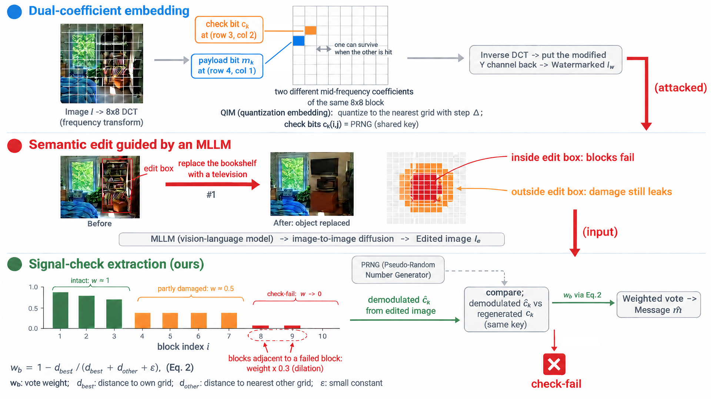
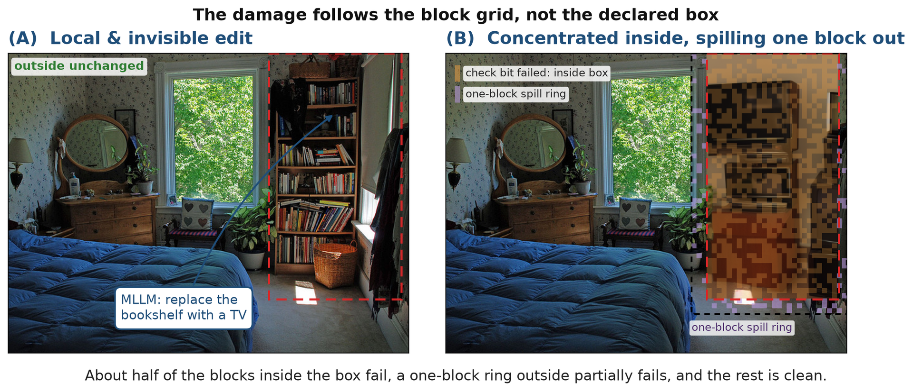

# Signal-Check: Training-Free Watermark Defense against MLLM-Guided Semantic Editing

Reference implementation for the paper:

> **Image Watermarking Robustness under MLLM-Guided Semantic Editing: Benchmark, Defense, and Diagnosis**



*Overview of the proposed pipeline. **Embedding** (top) writes a payload bit and a
pseudo-random check bit into two different mid-frequency DCT coefficients `(4,1)` and `(3,2)`
of every 8x8 block; the two coefficients are redundant with respect to each other rather than
identical, so an edit need not destroy both. **Attack** (middle) has an MLLM read the image,
emit a semantic editing instruction with a bounding box, and a diffusion inpainting model
execute it; the damage heat map shows that damage is concentrated inside the box but still
leaks into neighbouring blocks. **Extraction** (bottom) demodulates each block's check bit and
assigns a continuous vote weight: intact blocks keep a high weight, partially damaged blocks
are down-weighted, and check-failing blocks approach zero; neighbouring blocks of a failing
block are additionally down-weighted (spatial dilation) before weighted-majority voting.*

---

This repository contains the code for (i) generating a semantic-editing attack benchmark driven
by a multimodal LLM, (ii) the training-free **signal-check** defense, and (iii) the analysis and
figure-generation scripts.

---

## What the defense does

A classical DCT-QIM watermark embeds one payload bit per 8x8 block. We additionally embed a
pseudo-random **check bit** into a second mid-frequency coefficient of the same block:

| | payload | check |
|---|---|---|
| DCT coefficient | `(4,1)` | `(3,2)` |
| Purpose | carries the message | detects damage |

At extraction, blocks whose check bit is inconsistent are assumed damaged and their payload vote
is down-weighted:

- **Soft confidence** -- the weight is the demodulation confidence of the check bit,
  `w_b = 1 - d_best / (d_best + d_other + eps)`, so partially damaged blocks are attenuated
  rather than discarded.
- **Spatial dilation** -- semantic damage is spatially contiguous, so blocks adjacent to a
  failing block are also down-weighted (x0.3).

The result is a defense that is **training-free**, needs no labelled data, and is model-agnostic:
it adds one redundant bit and a confidence weight to any block-wise embedder.

---

## Installation

```bash
pip install torch diffusers transformers opencv-python numpy pillow matplotlib scipy ultralytics openai
```

A single consumer GPU (tested on an RTX 4060 Ti 16 GB) is sufficient.

## Configuration

Copy the template and fill in your API keys:

```bash
cp .mllm_env.example .mllm_env
```

`.mllm_env` is git-ignored and must never be committed.

## Data

The attack benchmark is built from **COCO val2017** and **DIV2K**. Point the loader at your local
copies (see `code/run_idea_probe.py`, `DATA_SOURCES`).

---

## Pipeline

```
code/
|- dct_watermark.py                  # DCT-QIM embed / extract primitives
|- run_mllm_benchmark.py             # MLLM attack generation + diffusion execution
|- run_signal_ra.py                  # signal-check defense (uniform / v1 / v2 / oracle)
|- run_second_mllm_attacker.py       # attack with a *second* MLLM (cross-model check)
|- analyze_second_mllm.py            # attack-severity stratification
|
|- run_ecc_vs_checkbit.py            # check bit vs Hamming(7,4) error-correcting code
|- run_jpeg_cascade.py               # robustness to post-edit JPEG re-encoding
|- run_full_inpaint_variant.py       # unmasked (global re-rendering) attack variant
|- run_capacity_curve.py             # 32/64/128/256-bit payload sweep
|- run_ablation_coef.py              # design-space ablations
|- run_diagnosis_quant.py            # quantified reliability of MLLM diagnosis
|
|- run_sota_comparison.py            # comparison against trained baselines
|- run_fidelity_metrics.py           # PSNR / SSIM / LPIPS over the 600-image set
|- make_figures.py                   # main figures
|- make_graphical_abstract.py        # graphical abstract
|- make_supplementary_v2.py          # supplementary figures
`- make_teaser.py                    # teaser and qualitative panels
```

### Revision analyses

Scripts added for the revised manuscript. Each one writes a timestamped JSON record into
`results/` (per-image rows, seeds and attack-set metadata included).

```
|- rev_analysis_r2r4r5.py            # per-block joint counts, budget- and fidelity-matched
|                                    #   controls, keyed-hash check sequence with key space
|                                    #   and throughput measurement, step-size x texture
|                                    #   sweep, chroma statistics
|- rev_delta_complete.py             # full step-size grid (7 steps x 6 decoder variants)
|- rev_capacity_control.py           # multi-message and second-attack-set capacity replication
|- rev_paired_tests.py               # per-image paired tests: bootstrap CI, t-test, Wilcoxon
|                                    #   signed-rank, Cohen's d (defense vs. baselines/oracle)
|- stratify_by_edit_area.py          # stratification by edited-area fraction
`- run_delta_sweep.py                # step-size sweep driver
```

### Reproducing the defense evaluation

```bash
cd code
python run_signal_ra.py --n 500 --msglen 256 --delta 15
```

### Cross-attacker check

```bash
cd code
python run_second_mllm_attacker.py --provider qwen --n 100
python analyze_second_mllm.py
```

`--provider` selects the attacker MLLM; the script reads `<PROVIDER>_API_KEY`,
`<PROVIDER>_BASE_URL` and `<PROVIDER>_MODEL` from `.mllm_env`.

### Reproducing a revision table

```bash
cd code
python rev_delta_complete.py      # -> results/delta_sweep_complete_*.json
python rev_capacity_control.py    # -> results/capacity_control_*.json
python rev_paired_tests.py        # -> results/paired_tests_*.json
```

### Result files

All analysis scripts write their outputs (per-image records plus summary tables) into `results/`.
The generated attack sets and all result files are released in this repository:

| path | contents | size |
|---|---|---|
| `results/attackset_20260817_082819/` | 50-image attack set (capacity and design-space tables) | 11 MB |
| `results/attackset_ip2p_20260908_075547/` | 200-image attack set (revision analyses) | 44 MB |
| `results/attackset_20261001_222447/` | 1200-image attack set (damage distribution) | 258 MB |
| `results/attackset_hires_sample/`, `results/attackset_kodak_hires/` | high-resolution qualitative sets | 39 MB |
| `results/*.json` | per-image records and summary tables behind every table of the paper | 4.3 MB |

Log files (`results/*.log`) are not tracked.

### Two check-sequence implementations

`run_signal_ra.py` — the pipeline behind the main tables — draws the check sequence from a
single 32-bit seed. That is the *seeded comparison* variant documented in the paper: its key
space is too small to resist exhaustive search, which is why the paper recommends the keyed
hash of Eq. (1) instead. That construction,

```
c_k(i, j) = LSB( SHA-256( K || block index ) ),   K is 128-bit,
```

is implemented in `rev_analysis_r2r4r5.py`; switching to it costs 0.14 points of attacked bit
accuracy (95.40% vs. 95.54%) and 0.003 dB of embedding PSNR, and the decoder is otherwise
unchanged.

---

## Key findings



*Semantic editing is local, but the watermark damage follows the block grid. Orange marks
check-bit failures: about half of the blocks inside the declared region (red dashed) fail their
check, roughly an eighth of the immediately adjacent blocks just outside it fail, and blocks
further out sit at the clean-image false-failure baseline. Because about half of the inside
blocks still vote correctly, a defense that discards the whole declared region throws those
votes away while also missing the boundary ring — which is why the damage is localized from the
watermark signal itself.*

1. **Semantic edits damage the watermark outside the edited region.** A bounding-box oracle that
   discards only the declared edit box underperforms the check-bit defense, because the damage
   leaks into neighbouring blocks.

2. **The check bit is not merely redundancy.** A Hamming(7,4) code carrying *more* redundancy
   performs *worse* than the undefended baseline, because error-correcting codes assume
   independent errors while semantic damage is spatially clustered.

3. **The gain is attacker-agnostic once severity is controlled.** Stratifying by the fraction of
   failing blocks, the high-damage stratum shows gains of +10.8pt (mimo-v2.5) and +10.5pt
   (Qwen3-VL-Plus) -- a difference of 0.3pt.

4. **There is an explicit operating envelope.** The defense works when an edit leaves a
   recoverable fraction of blocks intact; once >~35% of blocks are damaged, no block-voting
   scheme (trained or not) can reconstruct a 256-bit message. Under *global* re-rendering
   (unmasked inpainting) all training-free schemes fall to chance.

---

## License

Code released for research reproducibility. Third-party models (Stable Diffusion inpainting,
InstructPix2Pix) and datasets (COCO, DIV2K) retain their original licenses.
